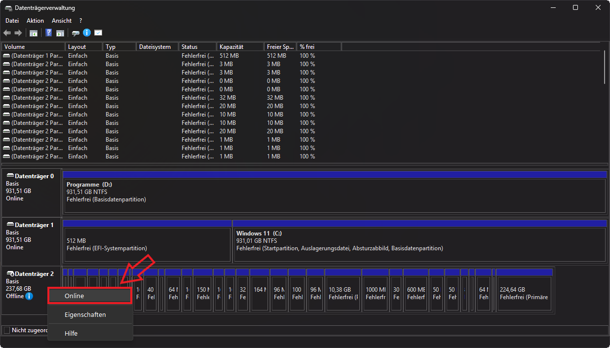
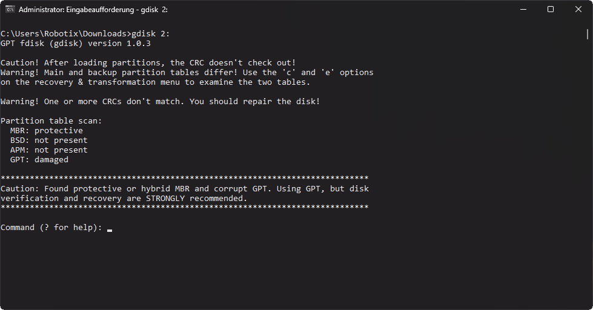

# Modifying your UFS

> [!CAUTION]
> This Guide is not Recommended for Basic Users! Only for Advanced Users!

## Video Guide

> [!NOTE]
> No Video Guide here yet.

## Text Guide [Recommended]

<table>
<tr><th>Guide Sections</th></th>
<tr><td>
  
- Modifying your UFS
   - [Requirements](#requirements)
   - [Preparing](#preparing)
   - [Setting UFS Online](#setting-ufs-online)
   - [Repairing UFS LUNs](#repairing-ufs-luns)

</td></tr>
</table>

## Requirements

- A Windows PC
- A Samsung Device with a Snapdragon SoC
- TWRP Recovery
- [Android SDK Tools](https://developer.android.com/tools/releases/platform-tools?hl=en)

## Preparing

Before you can beginn modding your UFS, You need to prepare some Things first. <br>
You will need the TWRP Recovery for your Device and [Mass Storage](../../../SoCs/Snapdragon/Mass-Storage/README.md) for your Device. <br>
Follow the Mass Storage Guide and come back here once you got it Running.

Once you have Mass Storage running on your Device, Download [gdisk](https://cdn.discordapp.com/attachments/1057409313381040261/1319684671486824478/gdisk?ex=67e765e0&is=67e61460&hm=a466cbcc47cbb5bd6b8971c8a8d1310341de355d15906d2fd01bf9c4471fa14b&) and save it somewhere where you will Find it again, Best would be the Download Folder. <br>
After you Downloaded the File, Push it to your Device using this Command:
```cmd
adb push gdisk /cache/
```

## Setting UFS Online

> [!CAUTION]
> This Section will Brick your Device if not Followed correctly!

Samsung sets their UFS on Snapdragon Devices Offline which breaks Windows / Linux Boot, So you need to set it Online. <br>
Open Disk Manager on your PC and Find the Disk with way to many Partitions. <br>
Right Click the Disk and Press `Online`.




Now Windows set it to Online and it should now be one Large Unformated Partition. <br>
Whatever you do, ***Don't* Reboot your Device!** <br>
You need to Repair it now, Enter ADB Shell using this Command:
```cmd
adb shell
```

After that Run `gdisk` on the UFS using these Commands:
```bash
# Makes the File Executable
chmod 744 /cache/gdisk

# Runs "gdisk"
./cache/gdisk /dev/block/sda
```
Once you Executed the Commands you should see a GPT Corrupted Warning:



Run these Commands in gdisk to Repair your GPT, First Enter `r`, That will Enter the Recovery Options. <br>
Then Enter `c`, That will now Repair your GPT, Now just Enter `w` and Confirm with `y` to Write the Changes. <br>
After you ran all these Commands it should Exit, Once it did, Rerun the gdisk Command and check if everything is Fine now. <br>
If all Partitions are there after using `p`, Exit using `q` and Power Off your Device.

## Repairing UFS LUNs

All you need to do now is follow the Snapdragon Generic [Fixing UFS LUNs](../../../SoCs/Snapdragon/Fixing-UFS-LUNs/README.md) Guide to Finish the UFS Modding.
